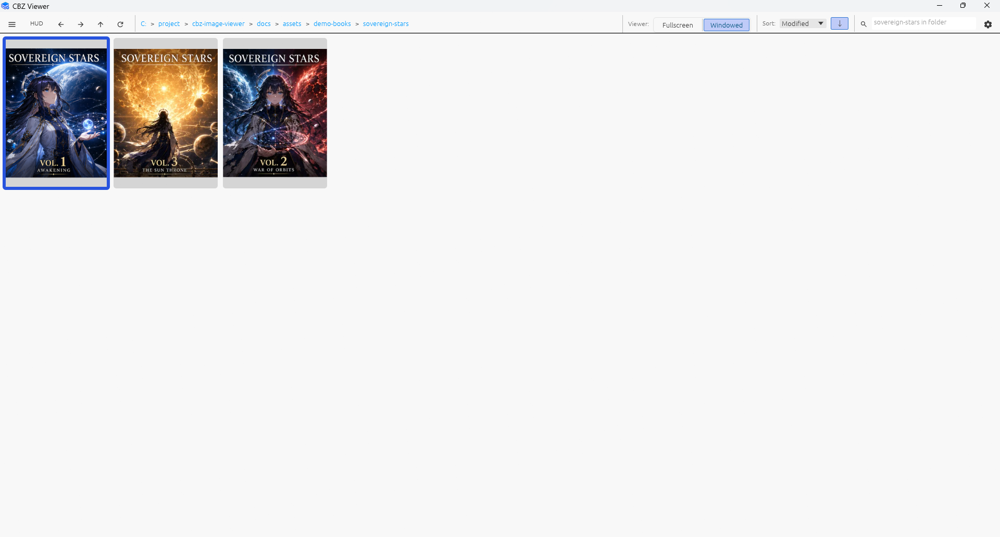
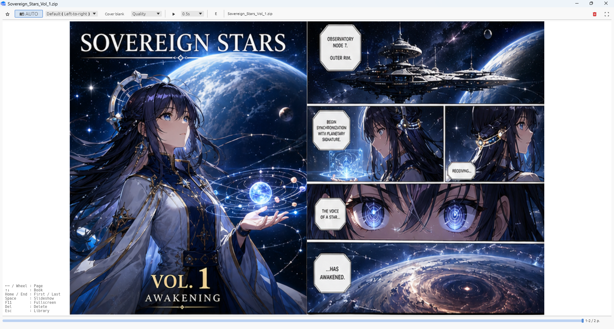

[English](README.md)

# cbz-tools-viewer

CBZ Viewer は、Windows 向けの漫画ビューアです。CBZ / ZIP / RAR / CBR / EPUB画像本と、直下に画像を持つフォルダを画像本として扱えます。Library では対応する動画ファイルも一覧表示できます。

動画ファイルを選択すると、Windows の関連付けアプリで開きます。CBZ Viewer 自体に動画再生機能はありません。

パッケージの実行ファイルは `cbz-viewer.exe` だけです。これは小さな
ランチャーで、初回起動時にビューア本体とランタイムを `%LOCALAPPDATA%\cbz-viewer`
配下のバージョン別ディレクトリへ検証・展開します。

---

# ダウンロード

最新版は [Latest Release](https://github.com/cbz-tools/cbz-tools-viewer/releases/latest) からダウンロードできます。

ZIP を展開し、`cbz-viewer.exe` を直接実行してください。追加インストールは不要で、
パッケージのランタイムは現在のユーザーのローカルアプリデータに保持されます。

---

# スクリーンショット

| Library | Viewer | Fullscreen |
|---|---|---|
|  |  |  |

### デモコンテンツについて

スクリーンショットに使用している **Sovereign Stars** は、CBZ Viewer のデモおよびスクリーンショット撮影用として GPT で生成した架空の漫画作品です。

実在の作品、人物、団体とは関係ありません。

デモ漫画素材も MIT License です。

---

# 主な特徴

* 先読みとキャッシュにより、大量ページの本でもページ移動の待ち時間を抑えます。次の本・前の本もバックグラウンドで先読みし、本を移動した直後の表示遅延を軽減します。
* Viewerでは、前後の本へ移動しながら不要な本を削除できるほか、不要なページ範囲を削除してアーカイブを再構築できます。
* アニメーション WebP のストリーミング再生に対応し、通常のページと同じようにシームレスにページ移動できます。見開き表示にも対応します。
* Library / Viewer からファイル名のtokenを使った絞り込み・コピー・WEB検索ができます。
* Libraryでは、本の検索・お気に入り・グループ分け・名前変更・削除など、コレクションの整理と管理ができます。
* Library / Viewer から登録した外部ツールを呼び出せます。兄弟プロジェクトの [**CBZ Tools Optimizer**](https://github.com/cbz-tools/cbz-tools-optimizer) と連携することで、圧縮最適化やフォーマット変換、サイズ削減などを行えます。
* Libraryでは、自動プレビューとスクラブに対応します。対応状況は以下の表のとおりです。

| Library項目 | サムネイル | 自動プレビュー | スクラブ |
| --- | --- | --- | --- |
| 動画 | ○ | ○ | ○ |
| 画像本 | ○ | — | ○ |
| アニメーションWebP | ○ | ○ | ○ |

---

# 背景

私は長年 ZipPla を利用していました。

その優れた閲覧体験は、本プロジェクトを開発する大きなきっかけとなりました。

CBZ Viewer は、自分自身が本当に使いたい Windows 向け漫画ビューアを目指して開発しています。

---

# 設計方針

CBZ Viewer は、ページ送りの待ち時間を抑えることを重視しています。

PC の CPU / RAM / VRAM に基づいて、先読み、キャッシュ、サムネイル生成をバックグラウンドで処理し、大量ページの本でも快適に閲覧できるよう設計しています。

また、閲覧やLibrary管理にはインターネット接続を必要としないオフラインアプリケーションです。

---

# 主な機能

CBZ Viewer は、次の3つの作業をまとめて扱えます。

* 読む: ページ移動、見開き、スライドショー、進捗表示、先読みキャッシュ
* 管理する: ライブラリ、検索、履歴、お気に入り、グループ、本移動
* 整理する: 名前変更、コピー、削除、Explorer で開く、ページ範囲を除外したアーカイブ再構築

詳細は [操作説明](docs/operation.ja.md) を参照してください。

---

# 外部ツール連携

CBZ Viewer は、読書中に外部ツールを呼び出せます。

兄弟プロジェクト [**CBZ Tools Optimizer**](https://github.com/cbz-tools/cbz-tools-optimizer) と連携することで、CBZ / ZIP の圧縮最適化、フォーマット変換、サイズ削減などを行えます。

---

# 動作環境

* Windows 10
* Windows 11

---

# 対応形式

## アーカイブ

* CBZ / ZIP
* RAR / CBR
* EPUB画像本

画像主体の EPUB に対応しています。テキストEPUB、reflow layout、CSS layout再現、DRM保護されたEPUB、音声、動画、JavaScript、SVGの描画には対応していません。

## フォルダ

* 直下に対応画像を持つフォルダを、画像本として開けます。

## 画像

* JPEG
* PNG
* WebP（静止画 / アニメーション）
* AVIF（.avif / .avifs）
* BMP
* TIFF
* GIF（静止画 / アニメーション）

単体の対応画像ファイルから起動した場合は、親フォルダを画像本として開き、指定画像から表示を開始します。

---

# ドキュメント

詳細な操作方法については以下を参照してください。

* [操作説明](docs/operation.ja.md)
* [Library表示設定](docs/operation.ja.md#library-display-settings)
* [Danger Zone 設定からの復旧](docs/DANGER_ZONE_RECOVERY.md)
* [L1 / L2 Streaming Cache](docs/dev/SimpleStreaming.md)
* [SPAD: Adjacent Book Scratchpad](docs/dev/Spad.md)

実装やアーキテクチャの詳細については docs を参照してください。

---

# 謝辞

ZipPla に限らず、多くの既存ビューアの優れた機能やユーザー体験から学び、影響を受けています。

本プロジェクトはゼロから Rust で実装していますが、その背景には先人たちの積み重ねがあります。

素晴らしいソフトウェアを公開してくださった作者の皆様に感謝いたします。

---

# 変更履歴

[CHANGELOG.md](CHANGELOG.md) を参照してください。

---

## サードパーティライセンス

[THIRDPARTY_LICENSES.md](THIRDPARTY_LICENSES.md) を参照してください。

---

## ライセンス

MIT — [LICENSE](LICENSE) を参照してください。
