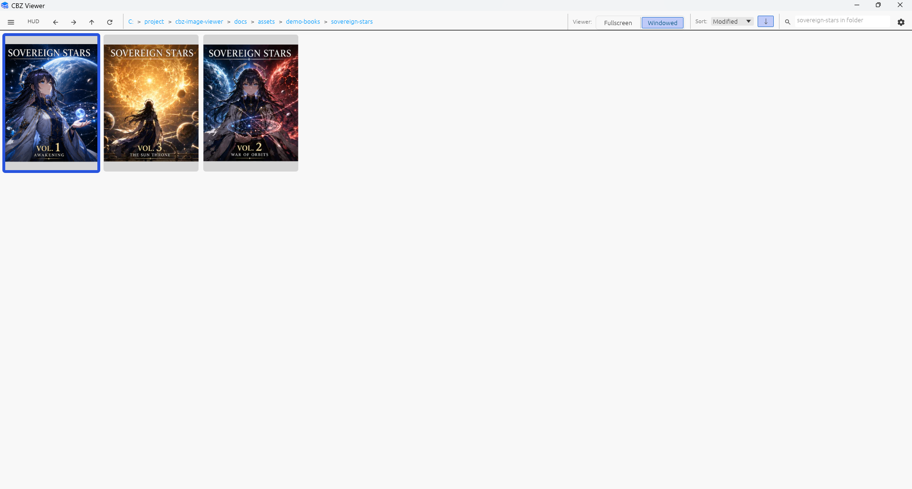
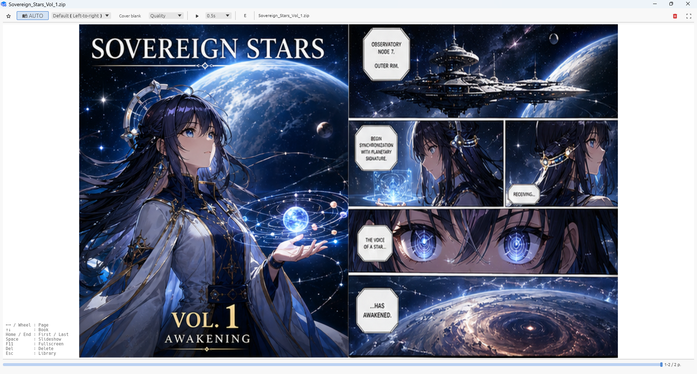
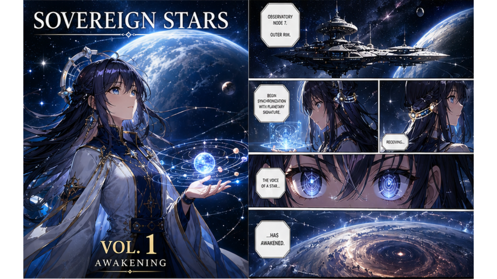

[日本語](README.ja.md)

# cbz-tools-viewer

CBZ Viewer is a Windows comic book viewer. It opens CBZ, ZIP, RAR, CBR, and EPUB image books, as well as folders that contain images directly under them.

The executable is `cbz-viewer.exe`.

---

# Download

Download the latest release from [Latest Release](https://github.com/cbz-tools/cbz-tools-viewer/releases/latest).

Extract the ZIP and run `cbz-viewer.exe` directly. No installation is required.

It includes:

* Library management
* Favorites
* Groups
* Book navigation
* External tool integration
* Default UI language: English
* Japanese can be selected in Settings
* Language changes take effect immediately
* No restart is required

---

# Why

I used ZipPla for many years.

Its excellent reading experience was one of the main reasons this project started.

CBZ Viewer is built as the Windows comic book viewer I personally wanted to use.

---

# Design Philosophy

CBZ Viewer focuses on minimizing page-turn latency.

It prioritizes the pages that are needed next so that even large books remain comfortable to read.

It is also an offline application that does not require an internet connection.

---

# Features

## Reading

* Right-to-left / Left-to-right
* AUTO / Single / Spread
* Cover blank
* Slideshow
* Quality: Speed, Balanced, High Quality, Original
* Page Map based progress display
* L1 / L2 Streaming Cache
* Animated WebP streaming playback, including spread view

Animation images do not use some of the quality processing.

## Managing

* Library management
* Search
* History
* Favorites
* Groups

## Organizing

* Rename
* Copy
* Delete
* Open in Explorer

### External tools

You can run:

* Archive optimization
* Format conversion
* Size reduction

while reading.

The companion project **CBZ Tools Optimizer** lets you move smoothly between reading and optimization.

---

# Requirements

* Windows 10
* Windows 11

---

# Supported formats

## Archive

* CBZ
* ZIP
* RAR
* CBR
* EPUB image books

EPUB support is intended for image-based EPUB books. CBZ Viewer uses the EPUB reading order and treats image references in XHTML pages as comic pages.

Text EPUB, reflow layout, CSS layout rendering, DRM-protected EPUB, audio, video, JavaScript, and SVG rendering are not supported.

## Folder

* Folders with images directly under them can be opened as books.

## Image

* JPEG
* PNG
* WebP (static / animated)
* AVIF (.avif / .avifs)
* BMP
* TIFF
* GIF

When you open a single supported image file, CBZ Viewer opens the parent folder as a book and starts from that image.

---

# Screenshots

| Library | Viewer | Fullscreen |
|---|---|---|
|  |  |  |

### Demo content

**Sovereign Stars** is a fictional comic created with GPT for CBZ Viewer demos and screenshots.

It is not related to any real work, person, or organization.

The demo manga assets are also licensed under the MIT License.

---

# Installation

Download the ZIP from Releases and extract it anywhere you like.

No additional installation is required.

---

# Documentation

See the following for detailed usage:

* [Operation Guide](docs/operation.md)
* [Library display settings](docs/operation.md#library-display-settings)
* [Danger Zone Recovery](docs/DANGER_ZONE_RECOVERY.md)
* [L1 / L2 Streaming Cache](docs/dev/SimpleStreaming.md)

See `docs` for implementation and architecture details.

---

# Acknowledgements

I have learned from and been influenced by the strengths and user experience of many viewers, not just ZipPla.

This project is implemented from scratch in Rust, but it stands on the work of many predecessors.

My thanks go to everyone who has released excellent software.

---

# License

This project is licensed under the MIT License.

See the LICENSE file for details.

Third-party components are documented in THIRDPARTY_LICENSES.md.

Demo manga assets are also licensed under the MIT License.
